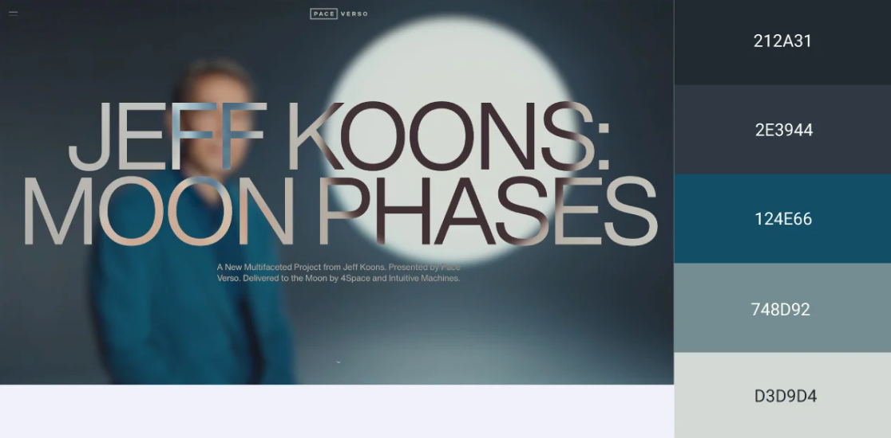

# Assessment-Task-3
<H1>Assessment Task 3</H1>

<H2>Objective</H2>

Designing a socially interactive learning platform that facilitates academic collaboration and resource sharing. The website should serve as a digital hub (like discord) but for topics that are related to education, promoting engagement through support from peers and study materials. 
<H2>Functional requirements</H2>
<ol>
    <li>Users should be able to create accounts and have secure login and logout processes. </li>
    <li>Users should be able to configure their personal data; avatars, biographies, usage statistics. (e.g. student IDs )</li>
    <li>Private messaging infrastructure, with real-time communication channels between users. (Private and public study groups)</li>
    <li>Find peers studying similar subjects, and groups or people who have the same interests.</li>
</ol>
<H2>Non-Functional requirements</H2>
<ol>
    <li>Consistency aesthetically pleasing elements (color, typography, spacing). Should have a high contrast readability. </li>
    <li>Streamlined and intuitive navigation structure. Should be easy for our age groups (Middle school to Uni) to use and access.  </li>
    <li>Cloud-based scalability to support increasing user loads. This minimizes crashes and makes sure the website doesn't slow down as more students and other members of community continue to access our website. </li>
</ol>

| Changing Element | Description |
| ----------- | ----------- |
| Typography | Instrumental Sans |
| Image/Icon Choice | Using AI or web images |

Colours will be based off of Jeff Koons: Moon Phases as shown below.
| Hex Code | Purpose |
|#212A31 | background colours | 
|#2E3944 | outlines and background colours | 
|#124E66 | more vibrant sections | 
|#748D92 | design and text |
|#D3D9D4 | text |
|#FFFFFF | text |

